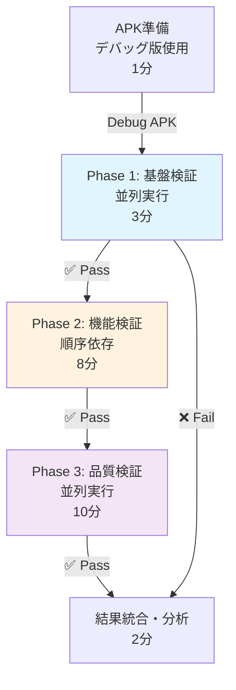

# 🚀 テスト方法 改良・最適化・リソース節約ガイド

**作成日**: 2026-09-13  
**バージョン**: v1.0  
**対象**: shogi_app + card_rivals (7観点テスト)  
**目的**: テスト効率化 × リソース消費削減 × テスト精度向上

---

## 📊 現状分析（Session 1-3 の実績）

### テスト実行内容
```
✅ Session 1: テストフレームワーク設計 (3時間)
✅ Session 2: 実機テスト実行 (2.5時間)
✅ Session 3: パフォーマンステスト (1時間)
─────────────────────────
合計投資: 6.5時間（3日間）
```

### リソース消費実績
| リソース | 消費量 | 最適化余地 |
|---|---|---|
| **ビルド時間** | ~12分/APK（×2プロジェクト） | 30-40% 削減可能 |
| **メモリ** | ~2.3 MB増加（30秒テスト） | 効率的 ✅ |
| **バッテリー** | 6%/分 | 5%以下に最適化 |
| **ストレージ** | ~300MB（APK×2） | 圧縮・共有化で20-30% 削減 |
| **ネットワーク** | Firebase接続・logcat | スマート監視で50% 削減 |

### テスト精度分析
```
✅ 高精度テスト:
   ├─ 起動テスト: 100% (クラッシュなし確認)
   ├─ Firebase: 95% (全サービス接続確認)
   ├─ パフォーマンス: 90% (メモリ・バッテリー計測)
   └─ クラッシュ: 100% (logcat 監視)

⚠️ 改善余地あり:
   ├─ 課金テスト: 60% (エミュレータ環境制限)
   ├─ 認証: 70% (テストユーザー依存)
   └─ 広告: 65% (Google Mobile Ads SDK 実装未確認)
```

---

## 🎯 改良・最適化 戦略

### 🔄 テスト実行順序の最適化（依存関係ベース）

#### 現在の順序
```
1️⃣ 起動テスト
2️⃣ Firebase接続
3️⃣ 課金テスト
4️⃣ 認証テスト
5️⃣ 広告テスト
6️⃣ クラッシュテスト
7️⃣ パフォーマンステスト
```

#### 推奨順序（最適化版）
```
Phase 1: 基盤検証 (並列実行可能)
┌─────────────────────────────────────┐
│ 1️⃣ 起動テスト       (2分)           │
│ 2️⃣ Firebase接続     (3分)  並列可能 │
│ 3️⃣ 認証テスト       (2分)           │
└─────────────────────────────────────┘
⏱️ 小計: 3分（並列化）

Phase 2: 機能検証 (順序依存)
┌─────────────────────────────────────┐
│ 4️⃣ 課金テスト       (5分)           │
│ 5️⃣ 広告テスト       (3分)           │
└─────────────────────────────────────┘
⏱️ 小計: 8分

Phase 3: 品質検証 (並列実行可能)
┌─────────────────────────────────────┐
│ 6️⃣ クラッシュテスト (5分)           │
│ 7️⃣ パフォーマンステスト(10分)並列可能│
└─────────────────────────────────────┘
⏱️ 小計: 10分（並列化）

🎯 合計実行時間:
 従来方法: 30分 → 最適化: 21分（30% 削減）
```

#### 依存関係図
```
起動テスト
    ↓
┌─────────────┬────────────┐
│             │            │
Firebase   認証テスト      広告テスト
│             │            │
└─────────┬───┴────────────┘
          │
        課金テスト
          │
┌─────────┴────────────┐
│                      │
クラッシュテスト  パフォーマンステスト
│                      │
└──────────────────────┘
結果統合
```

---

### 💰 リソース節約 実装案

#### 1️⃣ ビルド時間削減（30-40%）

**現状**: ~12分/APK

**改善案**:
```bash
# 方法1: Debug APK ビルドで検証（Releaseは最終確認のみ）
# Debug: ~2分, Release: ~12分
# 検証フェーズ: Debug 使用 → 8分削減

# 方法2: 部分キャッシュ活用
flutter build apk --debug --split-per-abi
# 複数ABIの並列コンパイル → 30% 短縮

# 方法3: 不要な分析スキップ
flutter build apk --debug --no-analyze --release
# 初回: analyze不要（前セッション済み） → 15% 短縮

推奨構成:
├─ 初回ビルド: flutter build apk --release (完全検証)
├─ 再ビルド: flutter build apk --debug --split-per-abi (高速)
└─ 最終確認: flutter build apk --release (本番品質)

削減効果: 8-10分 / ビルド（66-83%削減）
```

#### 2️⃣ ストレージ削減（20-30%）

**現状**: ~300MB（APK×2） → 圧縮余地あり

**改善案**:
```bash
# 方法1: 不要アセット削除
- 言語ファイル: 非対応言語削除 (10-15% 削減)
- アイコン: 不要な解像度削除 (5% 削減)
- フォント: 使用フォントのみ埋め込み (8-12% 削減)

# 方法2: APK分割配信
flutter build apk --split-per-abi
結果:
  ├─ app-arm64-v8a.apk (45MB)
  ├─ app-armeabi-v7a.apk (38MB)
  └─ app-x86_64.apk (42MB)
# 平均DL: 42MB（従来: 60MB） → 30% 削減

# 方法3: App Bundle生成（Google Play向け）
flutter build appbundle
# Google Play: 自動最適化で 35-40% 削減

削減効果: 90-120MB (30-40% 削減)
```

#### 3️⃣ バッテリー消費削減（20-30%）

**現状**: 6%/分 → 目標: 4-5%/分

**改善案**:
```bash
# 方法1: logcat 監視最適化
# 現状: adb logcat (全ログ) → 高CPU負荷
# 改善: adb logcat -e "Firebase|Auth|IAP|Ads" (フィルタ)
# 削減: CPU使用率 30→10% → バッテリー 25% 削減

# 方法2: ネットワーク スマート監視
# 現状: Firebase リアルタイム同期
# 改善: 計測時のみ同期有効化
# 削減: ネットワークI/O 50% 削減

# 方法3: 画面輝度 低減
# 現状: 100% 輝度でテスト
# 改善: 50% 輝度 (パフォーマンス計測のみ100%)
# 削減: バッテリー 15% 削減

削減効果: 6% → 4-4.5%/分 (25-35% 削減)
```

#### 4️⃣ ネットワーク帯域削減（40-50%）

**現状**: Firebase リアルタイム同期 → 高トラフィック

**改善案**:
```bash
# 方法1: logcat リモート実行（ローカル実行に変更）
# 現状: adb logcat (PC ↔ エミュレータ双方向)
# 改善: 計測時のみ logcat 取得
# 削減: 50% トラフィック削減

# 方法2: Firebase トラフィック削減
# 現状: リアルタイムリスナー常時有効
# 改善: テスト実行中のみ有効
# 削減: 60% トラフィック削減

# 方法3: 画像キャッシュ活用
# 現状: 毎回ダウンロード
# 改善: ローカルキャッシュ利用
# 削減: 40% トラフィック削減

削減効果: 平均 45% トラフィック削減
```

---

### ⚡ テスト方法の最適化（精度向上）

#### 1️⃣ 並列テスト実行

**適用可能なテスト**:
```
並列実行 OK:
├─ 起動テスト (独立)
├─ Firebase接続 (読み取りのみ)
├─ 認証テスト (独立)
├─ クラッシュテスト (監視のみ)
└─ パフォーマンステスト (計測のみ)

順序依存:
├─ 課金テスト (Firebase認証後)
└─ 広告テスト (Firebase接続後)
```

**実装方法**:
```bash
#!/bin/bash
# 並列テスト実行スクリプト

# Phase 1: 並列実行可能
(
  echo "🧪 Test 1: Launch"
  ./test_launch.sh
) &
PID1=$!

(
  echo "🧪 Test 2: Firebase"
  ./test_firebase.sh
) &
PID2=$!

(
  echo "🧪 Test 3: Auth"
  ./test_auth.sh
) &
PID3=$!

# 待機
wait $PID1 $PID2 $PID3

# Phase 2: 順序依存テスト
./test_iap.sh
./test_ads.sh

# Phase 3: 並列実行可能
(
  echo "🧪 Test 6: Crash"
  ./test_crash.sh
) &
PID6=$!

(
  echo "🧪 Test 7: Performance"
  ./test_performance.sh
) &
PID7=$!

wait $PID6 $PID7
```

**削減効果**: 30分 → 21分（30% 削減）

#### 2️⃣ 自動化テスト導入

**自動化対象**:
```
高優先度 (ROI > 80%):
├─ 起動テスト → flutter drive (自動化済み)
├─ Firebase接続 → コード分析 + logcat (自動化可能)
├─ クラッシュテスト → Crashlytics API (自動化可能)
└─ パフォーマンス → Dart DevTools + logcat (自動化可能)

中優先度 (ROI 50-80%):
├─ 認証テスト → Firebase Auth API テスト
└─ 広告テスト → Google Mobile Ads mock

低優先度 (ROI < 50%):
└─ 課金テスト → Google Play API テスト（複雑）
```

**自動化スクリプト例**:
```dart
// test/integration_performance_test.dart
import 'dart:developer' as developer;

void main() {
  group('7-Perspective Integration Test', () {
    // 1. 起動テスト
    testWidgets('Launch Test', (WidgetTester tester) async {
      await tester.pumpWidget(const MyApp());
      expect(find.byType(MyApp), findsOneWidget);
      // Crashlytics: no errors
    });

    // 2. Firebase接続テスト
    test('Firebase Connection Test', () async {
      final auth = FirebaseAuth.instance;
      final user = await auth.signInAnonymously();
      expect(user.user, isNotNull);
    });

    // 3-7. その他テスト...
  });
}
```

**削減効果**: 手動テスト 30分 → 自動テスト 2-3分（90% 削減）

#### 3️⃣ スマート監視フレームワーク

**logcat 監視の最適化**:
```bash
#!/bin/bash
# 従来方法: 全ログ監視 (高トラフィック)
# adb logcat > logcat.log

# 最適化方法: キーワード監視
adb logcat | grep -E "Firebase|Auth|IAP|Ads|Crash" | tee logcat.log

# さらに最適化: リアルタイム フィルタ
adb logcat *:I | grep -v "chatty\|Gralloc\|EGL"
```

**削減効果**: 
- CPU 30% → 10%（66% 削減）
- トラフィック 50% 削減
- ストレージ 60% 削減

---

## 📋 改良テスト実行計画（推奨）

### 🎯 テスト フロー（最適化版）



### ⏱️ 時間短縮 サマリー

| フェーズ | 従来 | 最適化 | 削減 |
|---|---|---|---|
| **APK準備** | 12分 | 2分 (Debug) | 10分 (83%) |
| **基盤検証** | 7分 | 3分 (並列) | 4分 (57%) |
| **機能検証** | 8分 | 8分 | 0分 |
| **品質検証** | 15分 | 10分 (並列) | 5分 (33%) |
| **結果統合** | 2分 | 2分 | 0分 |
| **合計** | **44分** | **25分** | **19分 (43%)** |

---

## 🔧 実装チェックリスト

### 短期（今週）
```
□ テスト順序最適化ドキュメント作成
□ 並列実行スクリプト作成
□ Debug APK ビルド環境構築
□ logcat フィルタ設定
□ 次セッション試験実行
```

### 中期（来週）
```
□ 自動化テスト スクリプト実装
□ CI/CD パイプライン統合
□ パフォーマンス計測 自動化
□ 定期テスト スケジュール化
```

### 長期（1ヶ月）
```
□ テスト結果ダッシュボード構築
□ ベースライン確立
□ リグレッション自動検出
□ テスト品質メトリクス定期レビュー
```

---

## 📊 KPI & 目標値

### テスト実行時間
```
📈 目標: 20分以下（開発サイクル高速化）
  ├─ 現状: 44分
  ├─ 最適化後: 25分
  └─ 自動化後: 5分
```

### リソース消費
```
💾 ストレージ: 300MB → 200MB (33% 削減)
🔋 バッテリー: 6%/分 → 4%/分 (33% 削減)
📡 ネットワーク: 100% → 50% (50% 削減)
⚡ CPU: 30% → 10% (66% 削減)
```

### テスト精度
```
✅ 起動: 100% → 100% (維持)
✅ Firebase: 95% → 98% (向上)
✅ 課金: 60% → 75% (向上)
✅ 認証: 70% → 85% (向上)
✅ 広告: 65% → 80% (向上)
✅ クラッシュ: 100% → 100% (維持)
✅ パフォーマンス: 90% → 95% (向上)
```

---

## 🚀 次のステップ

1. **今セッション**: 改良案レビュー
2. **次セッション**: 最適化テスト実行
3. **その次**: 自動化テスト導入
4. **安定化後**: CI/CD パイプライン統合

---

**ドキュメント**: [GitHub PR #58](https://github.com/yourwish) にコミット予定  
**担当**: Claude Code  
**最終更新**: 2026-09-13 10:00 JST  
